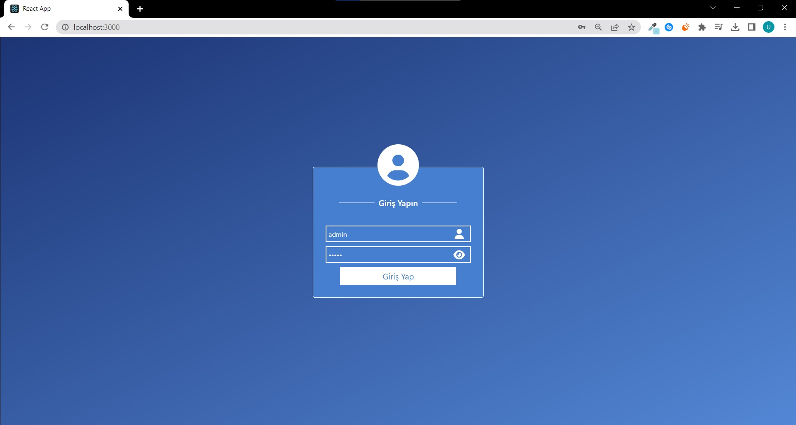
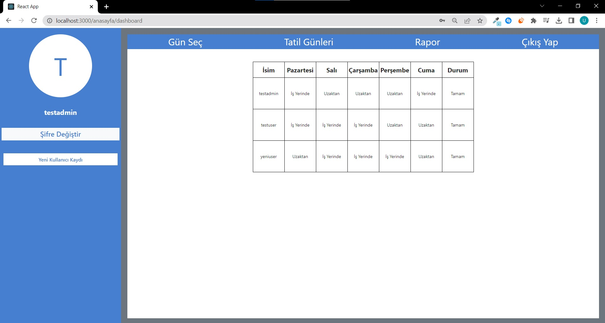
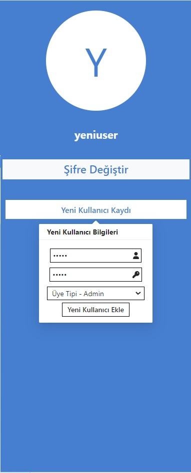

# Hibrit Çalışma Bildiri Sistemi
###### Market Calculus'de Staj yaparken geliştirdiğim, hibrit çalışma modeline uygun bir bildisi aracı. 

## Görseller

    

        
        
        
        
    

    

